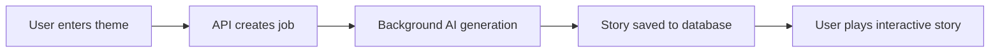

# 🏰 Choose Your Own Adventure - AI-Powered Interactive Storytelling


> **Transform simple themes into epic interactive adventures powered by AI**

A modern web application that generates **AI-powered interactive stories** where users make choices that determine the narrative direction. Think of classic "Choose Your Own Adventure" books, but dynamically created by artificial intelligence and delivered through a sleek web interface.

## 🎮 **Live Demo**

**Try it yourself:** 
1. Enter a theme like *"space pirates"*, *"underwater mystery"*, or *"medieval dragon quest"*
2. Watch as AI generates a complete branching story with multiple paths
3. Make choices that affect the story outcome
4. Discover different endings based on your decisions

## ✨ **Key Features**

### 🤖 **AI-Powered Story Generation**
- **Dynamic Content Creation** - Every story is unique and generated fresh
- **Multiple Story Paths** - Branching narratives with meaningful choices
- **Various Endings** - Both winning and losing scenarios
- **Theme-Based Generation** - Stories adapt to any theme you provide

### ⚡ **Modern Architecture**
- **Asynchronous Processing** - Non-blocking story generation
- **Real-time Updates** - Live job status monitoring
- **Session Management** - Your progress is tracked and saved
- **RESTful API** - Clean, documented endpoints

### 🎯 **Interactive Gameplay**
- **Choice-Driven Narrative** - Every decision matters
- **Restart & Replay** - Try different paths through the same story
- **Progress Tracking** - Session-based story management
- **Responsive Design** - Works on desktop and mobile

## 🏗️ **Technology Stack**

### **Backend (FastAPI + AI)**
- **🐍 Python 3.12** - Modern Python with type hints
- **⚡ FastAPI** - High-performance async web framework
- **🗄️ SQLAlchemy** - Powerful ORM for database operations
- **🔧 Pydantic** - Data validation and serialization
- **🤖 LangChain + OpenAI** - AI story generation pipeline
- **🐘 PostgreSQL/SQLite** - Robust data storage
- **📦 UV** - Fast Python package management

### **Frontend (React + Vite)**
- **⚛️ React 19** - Modern UI framework
- **🚀 Vite** - Lightning-fast development server
- **🧭 React Router** - Client-side routing
- **📡 Axios** - HTTP client for API communication
- **🎨 CSS3** - Custom styling and animations

## 📂 **Project Structure**

```
Choose-Your-Own-Adventure/
├── 📁 backend/                 # FastAPI Backend
│   ├── 📄 main.py             # Application entry point
│   ├── 📁 core/               # Core business logic
│   │   ├── 📄 config.py       # Environment configuration
│   │   ├── 📄 story_generator.py # AI story generation
│   │   ├── 📄 prompts.py      # AI prompt templates
│   │   └── 📄 models.py       # Pydantic response models
│   ├── 📁 models/             # SQLAlchemy database models
│   │   ├── 📄 story.py        # Story and StoryNode models
│   │   └── 📄 job.py          # Background job tracking
│   ├── 📁 schemas/            # API request/response schemas
│   │   ├── 📄 story.py        # Story-related schemas
│   │   └── 📄 job.py          # Job status schemas
│   ├── 📁 routers/            # API route handlers
│   │   ├── 📄 story.py        # Story endpoints
│   │   └── 📄 job.py          # Job monitoring endpoints
│   ├── 📁 db/                 # Database configuration
│   └── 📄 pyproject.toml      # Python dependencies
├── 📁 frontend/               # React Frontend
│   ├── 📁 src/
│   │   ├── 📄 App.jsx         # Main application component
│   │   ├── 📁 components/     # React components
│   │   │   ├── 📄 StoryGenerator.jsx # Story creation interface
│   │   │   ├── 📄 StoryLoader.jsx    # Story loading handler
│   │   │   ├── 📄 StoryGame.jsx      # Interactive gameplay
│   │   │   ├── 📄 ThemeInput.jsx     # Theme input form
│   │   │   └── 📄 LoadingStatus.jsx  # Loading indicators
│   │   └── 📄 main.jsx        # React entry point
│   ├── 📄 package.json        # Node.js dependencies
│   └── 📄 vite.config.js      # Vite configuration
└── 📄 README.md               # This file
```

## 🚀 **Quick Start**

### **Prerequisites**
- **Python 3.12+** 
- **Node.js 18+** 
- **OpenAI API Key** ([Get one here](https://platform.openai.com/api-keys))

### **1. Clone the Repository**
```bash
git clone https://github.com/pavan-kumar-v-pkv/Choose-Your-Own-Adventure.git
cd Choose-Your-Own-Adventure
```

### **2. Backend Setup**
```bash
cd backend

# Install Python dependencies with UV
uv add fastapi[all] langchain-openai python-dotenv sqlalchemy uvicorn psycopg2-binary pydantic-settings

# Configure environment variables
cp .env.example .env
# Edit .env and add your OpenAI API key
```

**Environment Configuration (`.env`):**
```env
DATABASE_URL=sqlite:///./database.db
API_PREFIX=/api
DEBUG=True
ALLOWED_ORIGINS=http://localhost:3000,http://localhost:5173
OPENAI_API_KEY=your_openai_api_key_here
```

### **3. Frontend Setup**
```bash
cd ../frontend

# Install Node.js dependencies
npm install

# Optional: Install additional packages if needed
npm install react-router-dom axios
```

### **4. Run the Application**

**Terminal 1 - Backend:**
```bash
cd backend
uv run python main.py
```
**✅ Backend running at:** `http://localhost:8000`

**Terminal 2 - Frontend:**
```bash
cd frontend
npm run dev
```
**✅ Frontend running at:** `http://localhost:5173`

### **5. Open and Enjoy!**
Visit `http://localhost:5173` in your browser and start creating stories!

## 📖 **How It Works**

### **1. Story Creation Flow**


### **2. API Architecture**
```
POST /api/stories/create → Returns job_id (immediate)
GET /api/jobs/{job_id} → Check generation status
GET /api/stories/{story_id}/complete → Get full story with all paths
```

### **3. Data Models**

**Story Structure:**
- **Story**: Container (title, theme, session)
- **StoryNode**: Individual segments with choices
- **Options**: Available paths to other nodes

**Background Jobs:**
- **Asynchronous processing** for AI generation
- **Status tracking** (pending → processing → completed/failed)
- **Error handling** with detailed messages

## 🎯 **API Documentation**

With the backend running, visit:
- **📚 Interactive API Docs (Swagger):** http://localhost:8000/docs
- **📖 Alternative Docs (ReDoc):** http://localhost:8000/redoc

### **Key Endpoints:**

| Method | Endpoint | Description |
|--------|----------|-------------|
| `POST` | `/api/stories/create` | Generate new story from theme |
| `GET` | `/api/jobs/{job_id}` | Check story generation progress |
| `GET` | `/api/stories/{story_id}/complete` | Retrieve complete story |

## 🎮 **Usage Examples**

### **Creating a Story via API**
```bash
# 1. Create story
curl -X POST "http://localhost:8000/api/stories/create" \
     -H "Content-Type: application/json" \
     -d '{"theme": "underwater pirate adventure"}'

# Response: {"job_id": "abc123", "status": "pending"}

# 2. Check status
curl "http://localhost:8000/api/jobs/abc123"

# Response: {"job_id": "abc123", "status": "completed", "story_id": 5}

# 3. Get story
curl "http://localhost:8000/api/stories/5/complete"
```

### **Example Story Response**
```json
{
  "id": 5,
  "title": "The Underwater Pirate's Treasure",
  "session_id": "user123",
  "root_node": {
    "id": 1,
    "content": "You dive deep into the ocean...",
    "is_root": true,
    "options": [
      {"text": "Follow the treasure map", "node_id": 2},
      {"text": "Explore the coral reef", "node_id": 3}
    ]
  },
  "all_nodes": {
    "1": {...}, "2": {...}, "3": {...}
  }
}
```

## 🔧 **Development**

### **Backend Development**
```bash
cd backend

# Run with hot reload
uv run python main.py

# Run tests (when available)
uv run pytest

# Type checking
uv run mypy .
```

### **Frontend Development**
```bash
cd frontend

# Development server with hot reload
npm run dev

# Build for production
npm run build

# Preview production build
npm run preview

# Linting
npm run lint
```

## 🚀 **Deployment**

### **Backend (FastAPI)**
- **Recommended:** Deploy on platforms like Railway, Render, or AWS
- **Docker:** Containerize with provided Dockerfile
- **Environment:** Set production environment variables

### **Frontend (React)**
- **Recommended:** Deploy on Vercel, Netlify, or Cloudflare Pages
- **Build:** `npm run build` creates optimized production build
- **Environment:** Configure API base URL for production

## 🤝 **Contributing**

1. **Fork the repository**
2. **Create feature branch:** `git checkout -b feature/amazing-feature`
3. **Commit changes:** `git commit -m 'Add amazing feature'`
4. **Push to branch:** `git push origin feature/amazing-feature`
5. **Open Pull Request**

## 📝 **License**

This project is licensed under the MIT License - see the [LICENSE](LICENSE) file for details.

## 🙏 **Acknowledgments**

- **OpenAI** for providing powerful language models
- **FastAPI** for the excellent web framework
- **React** for the frontend framework
- **LangChain** for AI integration utilities

## 📧 **Contact**

**Pavan Kumar V** - [@pavan-kumar-v-pkv](https://github.com/pavan-kumar-v-pkv)

**Project Link:** [https://github.com/pavan-kumar-v-pkv/Choose-Your-Own-Adventure](https://github.com/pavan-kumar-v-pkv/Choose-Your-Own-Adventure)

---

⭐ **Star this repo if you found it helpful!**